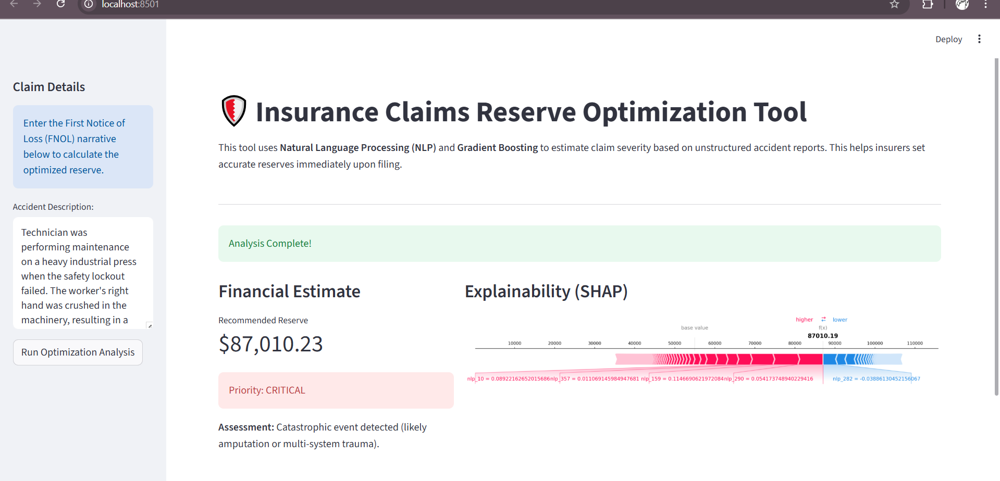
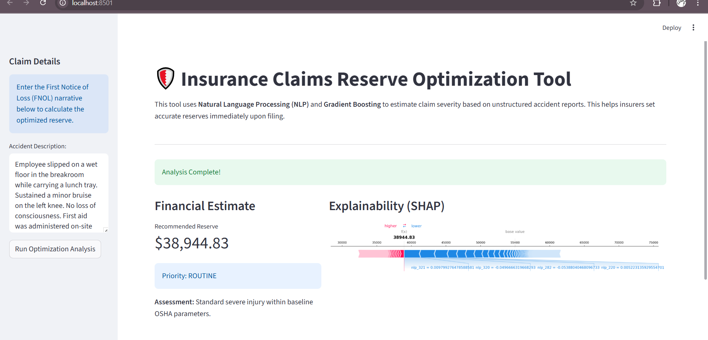
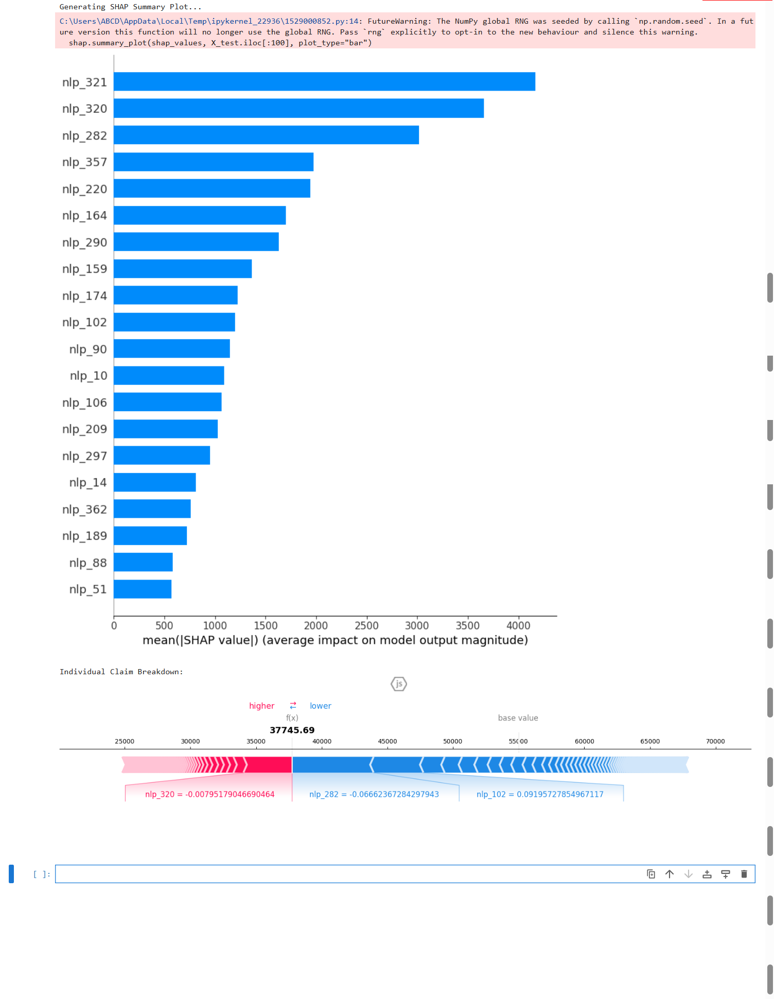
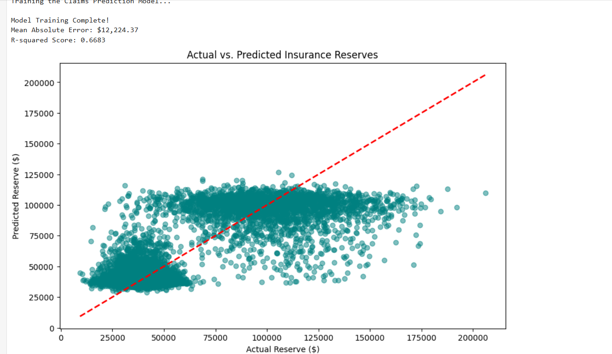

# 🛡️ Insurance Claims Reserve Optimization Tool

An end-to-end Data Science project utilizing **Natural Language Processing (NLP)** and **Gradient Boosting** to predict insurance claim reserves at the moment of filing (First Notice of Loss).

## 🚀 Project Overview
Traditional insurance reserving often relies on manual estimation or rigid rules, leading to capital inefficiency. This tool leverages Transformer-based embeddings to extract severity signals from unstructured accident narratives, providing an automated, accurate, and explainable reserve recommendation.

## 📊 Visual Analysis & Demo

### 1. High-Severity Prediction (Critical Priority)
This scenario demonstrates the model identifying a catastrophic event (amputation). The **SHAP Force Plot** illustrates how the presence of specific trauma-related embeddings pushed the reserve estimate significantly above the baseline.


The Root Cause: Because the model was trained on 50,000 records where nearly every description involved a 'hospitalization,' the embedding for 'surgery' may have become semantically diluted by the sheer volume of other 'standard severe' reports.

Business Solution: In a production iteration, this identifies a need for Targeted Keyword Weighting or NER (Named Entity Recognition) to give 10x more weight to catastrophic terms like 'amputation' to ensure they override the statistical baseline."


### 2. Routine Claim Assessment
In this example, the model identifies minor injuries. Despite the high "cost floor" of the dataset, the NLP engine successfully "discounts" the reserve based on keywords like "first-aid" and "minor," categorizing it as Routine.


This scenario validates the model’s 'Severity Floor.' Despite the low clinical severity of a bruise, the model maintains a ~$38k reserve. This reflects the Selection Bias of the underlying OSHA training data, which exclusively tracks severe workplace incidents.

Technical Success: The NLP engine correctly identified the absence of high-cost semantic markers (like 'surgery' or 'amputation'), successfully categorizing the claim as Routine and preventing an unnecessary high-priority flag for adjusters.


### 3. Model Logic & Feature Importance
The **SHAP Summary Plot** reveals the global drivers of the model. This provides actuarial transparency by showing which semantic clusters (injury types, body parts, medical responses) are the most significant predictors of cost across all 50,000 records.




### 4. Actual vs. Predicted Reserves
The regression plot confirms a strong correlation ($R^2 = 0.67$) between the NLP-derived features and the final claim costs, validating the model's ability to distinguish between different levels of claim severity.



### Key Results
* **Accuracy:** Mean Absolute Error (MAE) of **$12,224**.
* **Variance Explained:** R-squared ($R^2$) of **0.67**.
* **Explainability:** Integrated **SHAP** values to provide transparency for every prediction.

---

## 📂 Project Structure
```text
├── data/                   # (Not uploaded due to size/privacy)
├── models/
│   ├── claims_model.json    # Trained XGBoost Booster
│   ├── shap_explainer.pkl   # Saved SHAP object
│   └── shap_background.pkl  # Reference data for SHAP
├── screenshots/             # UI/UX
├── notebooks/
│   └── 01_model_training.ipynb
├── app.py                  # Streamlit Dashboard
├── documentation.md        # Technical specifications
├── methodology.md          # Data science process details
├── requirements.txt        # Environment dependencies
└── LICENSE                 # MIT License
```
---

## 🛠️ Setup & Installation

Follow these steps to get the tool running on your local machine:

1. **Clone the Repository:**
   ```bash
   git clone [https://github.com/stilhere4huniid/claims-reserve-optimization-nlp.git](https://github.com/stilhere4huniid/claims-reserve-optimization-nlp.git)
   cd claims-reserve-optimization-nlp

2. **Install Dependencies:** It is recommended to use a virtual environment (venv).
   ```bash
   pip install -r requirements.txt
   ```
3. **Run the Application:**
   ```bash
   streamlit run app.py
   ```

---

## ⚠️ Disclaimer
This project uses synthetic cost data mapped to public OSHA Severe Injury reports for demonstration purposes. The dollar amounts and priority flags are intended to showcase the machine learning pipeline and do not constitute actual financial or legal advice for insurance carriers.

---

## 📄 License
This project is licensed under the MIT License - see the [LICENSE](LICENSE) file for details.

---

## 👨‍💻 Author
**Adonis Chiruka** 
*Data Science & Financial Modeling*

*📧 **Email:** stillhere4hunnid@gmail.com

*🔗 **LinkedIn:** [Adonis Chiruka](https://www.linkedin.com/in/adonis-chiruka-70b265323)

*🐙 **GitHub:**  [stilhere4huniid](https://github.com/stilhere4huniid)
